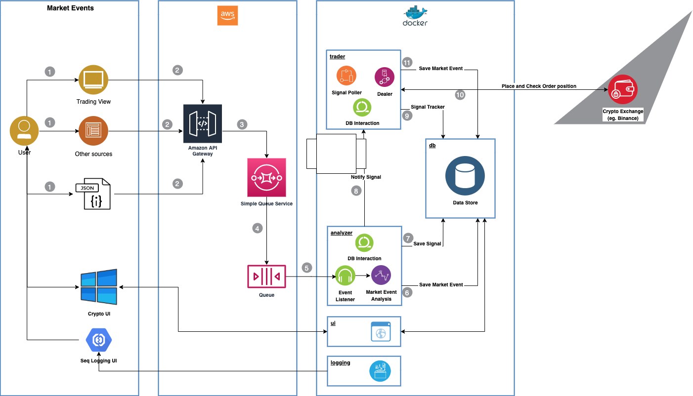

# BSN Cryptobot

A basic cryptocurrency trading bot designed to operate with multiple exchanges and 'signal sources'.

This repository contains the scripts to pull down and run the various components of the bot (as seen in the architecture diagram). Each component runs in its own docker container. (see requirements below)

## Architecture

## State diagram

## Bot sources

- [Analyser](https://github.com/bsn-group/analyzer)
- [Trader](https://github.com/bsn-group/trader)
- [UI](https://github.com/bsn-group/cryptobot-ui)

## Supported external systems

### Event Sources

- TradingView via webhooks

### Exchanges

- Binance

### Requirements

v.1.29.1 or above of [docker-compose](https://github.com/docker/compose/releases) or above.

This script has been tested on docker-compose v.1.29.1 on Windows 10 (using WSL2 + Docker), MacOSX (10.15 Catalina + Docker desktop), and Ubuntu server (18.4 + Docker).

To check docker-compose version

`docker-compose -version`

To update

`sudo curl -L <https://github.com/docker/compose/releases/download/1.29.1/docker-compose-Linux-x86_64> -o /usr/local/bin/docker-compose`

In progress